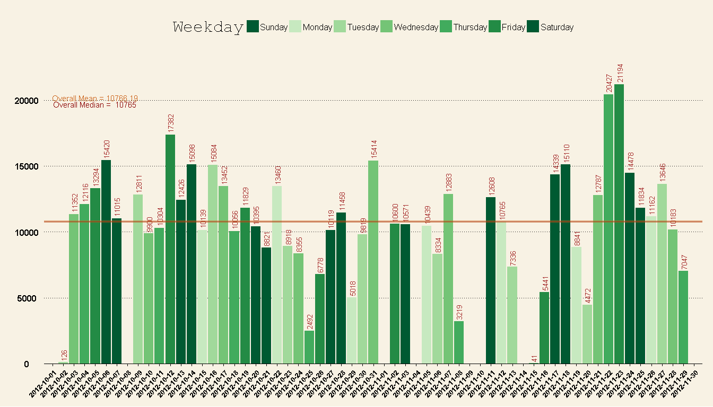
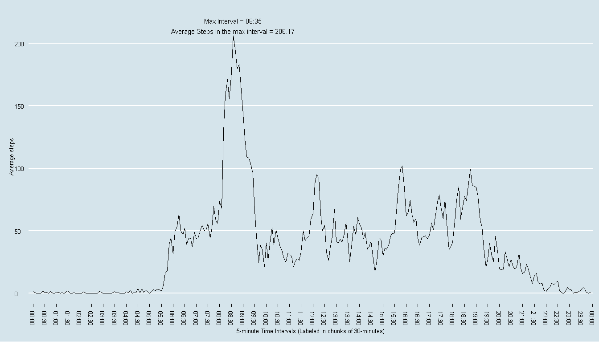
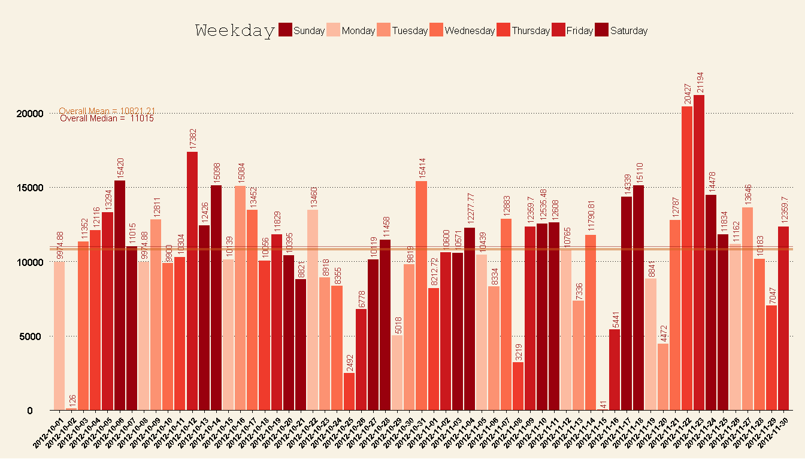
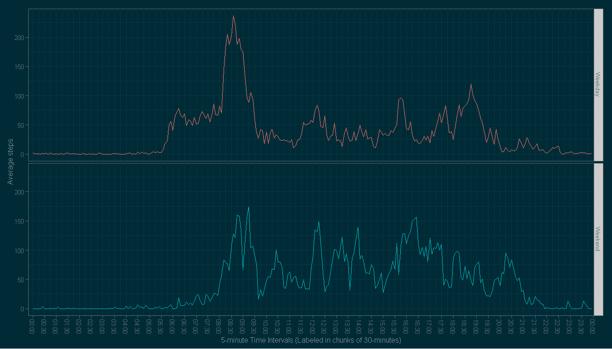

# Reproducible Research: Peer Assessment 1


## Loading and preprocessing the data

```r
require(ggplot2)
```

```
## Loading required package: ggplot2
```

```r
require(lubridate)
```

```
## Loading required package: lubridate
```

```r
require(RColorBrewer)
```

```
## Loading required package: RColorBrewer
```

```r
require(dplyr)
```

```
## Loading required package: dplyr
## 
## Attaching package: 'dplyr'
## 
## The following objects are masked from 'package:lubridate':
## 
##     intersect, setdiff, union
## 
## The following object is masked from 'package:stats':
## 
##     filter
## 
## The following objects are masked from 'package:base':
## 
##     intersect, setdiff, setequal, union
```

```r
require(ggthemes)
```

```
## Loading required package: ggthemes
```

```
## Warning: package 'ggthemes' was built under R version 3.1.3
```

```r
library(scales)

loadData <- function(dataURL="", destF="default.csv", method = NULL){
  if(!file.exists(destF)){
            temp <- tempfile()
            download.file(dataURL, temp, method = method)
            unzip(temp, destF)
            unlink(temp)
        }else{
            message("Data already downloaded.")
        }
}

dataURL <-"https://d396qusza40orc.cloudfront.net/repdata%2Fdata%2Factivity.zip"


loadData(dataURL, "activity.csv")
```

```
## Data already downloaded.
```

```r
active <- read.csv("activity.csv")

active$date<-as.Date(active$date)
```
Lubridate's wday function can fill in the Weekday's full names as ordered factor variables. Sun to Sat.

Create a column of these days of the week for each date for subsetting.

```r
active$Weekday<-wday(active$date, label = TRUE, abbr = FALSE)
```
Quick look at the data

```r
head(active)
```

```
##   steps       date interval Weekday
## 1    NA 2012-10-01        0  Monday
## 2    NA 2012-10-01        5  Monday
## 3    NA 2012-10-01       10  Monday
## 4    NA 2012-10-01       15  Monday
## 5    NA 2012-10-01       20  Monday
## 6    NA 2012-10-01       25  Monday
```


## What is mean total number of steps taken per day?
###Create function which takes the active dataframe, and an RBrewers color scheme for customization. 

Color scheme defaults to "Greens"

Weekend are colored the same dark color to identify better. 

Weekdays start light on Monday and gradually get darker as they approach the Weekend.

Creates a plot which:

1.) Makes a histogram of the total number of steps taken each day

2.) Calculates and reports the mean and median total number of steps taken per day


```r
make.sums.ggplot<- function(active.dataframe, RBrewers.colors = "Greens"){
  
  #Transmform the data and get averages.

  #Sum up steps of the data.frame, grouped by date
  active.sums <- active.dataframe %>%
    group_by(date, Weekday) %>%
    summarise(total_steps = sum(steps))
  
  # Create a vector of brewer greens for representing the ordinal change from Monday to Sunday.
  # Brewer.pal takes an integer (n) and an RBrewer color set. 
  # It then creates (n) gradients of color that cover the passed in color set. 
  # 7 is passed in because there are 7 factors: each day of the week.
  my.cols <- brewer.pal(7, RBrewers.colors)
  # Ordered factors start on Sunday. Rather than reordering the date factor variables, we can just reassign the color for Saturday to Sunday as well. This will make the Weekends stand out.
  my.cols[1] <- my.cols[7]
  # Get max number of steps for largest interval for extending y-axis to fit labels.
  max.sum <- max(active.sums$total_steps, na.rm = TRUE)
  
  
  ggplot(active.sums, aes(x = date, y = total_steps, fill = Weekday)) + geom_bar(stat = "identity") +
    scale_x_date(breaks="1 day", 
                 limits = as.Date(c('2012-10-03','2012-11-28'))) +
    theme_wsj() +    
    theme(axis.text.x  = element_text(size=10,
                                      angle=45,
                                      colour="black",
                                      vjust=1,
                                      hjust=1)) + 
    scale_fill_manual(values = my.cols) + 
    geom_text(aes(x = date, 
                  y = total_steps, 
                  label = total_steps, 
                  angle  = 90, 
                  size = 5, 
                  hjust = -0.1), 
              color = "brown", 
              show_guide  = F) + 

      coord_cartesian(ylim=c(0,max.sum*1.15)) +
    geom_hline(aes ( yintercept = mean(total_steps, na.rm = TRUE)), 
               color = "chocolate3", 
               size = 1.5, 
               alpha = .50) + 
    geom_hline(aes ( yintercept = median(total_steps, na.rm = TRUE)), 
               color = "darkred", 
               alpha = .50) +
    geom_text(aes(label = paste("Overall Mean =", round(mean(total_steps, na.rm = TRUE), 2) ),
                  x = as.Date('2012-10-05'),
                  y = 20200), 
              color = "chocolate3", 
              size = 4) +
    geom_text(aes(label = paste("Overall Median = ", round(median(total_steps, na.rm = TRUE), 2) ),
                  x = as.Date('2012-10-05'),
                  y = 19700),
              color = "darkred",
              size = 4) +
    ylab("Total Steps taken per day") +
    xlab(NULL)
}

make.sums.ggplot(active, "Greens")
```

```
## Warning: Removed 8 rows containing missing values (position_stack).
```

```
## Warning: Removed 8 rows containing missing values (geom_text).
```

 


## What is the average daily activity pattern?


```r
# Create a function which:

# 1.) Makes a time series plot (i.e. type = "l") of the 5-minute interval (x-axis) and the average number of steps taken, averaged across all days (y-axis) This plotted in 5 minute intervals but labeled in 30 minute intervals to reduce labeling clutter.

# 2.) Reports the 5-minute interval, on average across all the days in the dataset, which contains the maximum number of steps


# 5 interval column data is from 0-60, then 100-160, etc.
# Converts 5 minute interval data to POSIXct format (60 minutes in an hour)

active$Interval <- as.POSIXct(strptime(sprintf("%04d", active$interval), "%H%M")) 


make.max.interval.ggplot<- function(active.dataframe){

    # Use dplyr's piping functions to transform data 
    # then pass that transformed data to the next transform function.
  active.intervals <- active.dataframe %>%
    group_by(Interval) %>%
    summarise(Average = mean(steps, na.rm = TRUE)) %>%
    arrange(Interval)

    # Pulls out the row which had the max average into a one row data.frame
  max.active <- active.intervals[which.max(active.intervals$Average),]
    # Grab the max interval for plotting. 
    # Assign to global environment since ggplot can't find it when called from within a function.
  max.interval <<- max.active$Interval[1]
    # Grab the average steps for plotting.
  max.average <<- round(max.active$Average[1], 2)

  
  ggplot(active.intervals, aes(x = Interval, y = Average)) +
    geom_line() +
    theme_economist() +
    geom_text(aes(label = paste("Max Interval =", format(max.interval, "%H:%M")),
                  x = max.interval,
                  y = max.average + 12),
              color = "black",
              size = 4) +
    geom_text(aes(label = paste("Average Steps in the max interval =", max.average ),
                  x = max.interval,
                  y = max.average + 4),
              color = "black",
              size = 4) + 
    theme(axis.text.x=element_text(angle=270,
                                   hjust=1,
                                   vjust=0.5,
                                   size = 10)) + 
    scale_x_datetime(breaks = date_breaks("30 mins"),
                     labels = date_format("%H:%M"),
                     limits = c(active.intervals$Interval[12], active.intervals$Interval[286-10])) +
    ylab("Average steps") + 
    xlab("5-minute Time Intervals (Labeled in chunks of 30-minutes)")
}

make.max.interval.ggplot(active)
```

 

```r
## Imputing missing values
#### 1.) Calculate and report the total number of missing values in the dataset (i.e. the total number of rows with NAs)
```

```r
summary(active)
```

```
##      steps             date               interval           Weekday    
##  Min.   :  0.00   Min.   :2012-10-01   Min.   :   0.0   Sunday   :2304  
##  1st Qu.:  0.00   1st Qu.:2012-10-16   1st Qu.: 588.8   Monday   :2592  
##  Median :  0.00   Median :2012-10-31   Median :1177.5   Tuesday  :2592  
##  Mean   : 37.38   Mean   :2012-10-31   Mean   :1177.5   Wednesday:2592  
##  3rd Qu.: 12.00   3rd Qu.:2012-11-15   3rd Qu.:1766.2   Thursday :2592  
##  Max.   :806.00   Max.   :2012-11-30   Max.   :2355.0   Friday   :2592  
##  NA's   :2304                                           Saturday :2304  
##     Interval                  
##  Min.   :2015-03-12 00:00:00  
##  1st Qu.:2015-03-12 05:58:45  
##  Median :2015-03-12 11:57:30  
##  Mean   :2015-03-12 11:57:30  
##  3rd Qu.:2015-03-12 17:56:15  
##  Max.   :2015-03-12 23:55:00  
## 
```


```r
# Subset out all rows with an NA value, 2304 rows
NA.active <- subset(active, !complete.cases(active))
# All NAs are contained in 8 days, which have all steps missing in each day 
table(NA.active$date)
```

```
## 
## 2012-10-01 2012-10-08 2012-11-01 2012-11-04 2012-11-09 2012-11-10 
##        288        288        288        288        288        288 
## 2012-11-14 2012-11-30 
##        288        288
```
#### 2.) We will impute the values by filling in the mean of the steps in each interval. 

For example, to fill in NA's on Monday's at 12:00, all "12:00 - 12:05" intervals for all Monday's will be used to get the imputed value.

The same will be done for Tuesday's in this time period, etc. So that each unique day has different means in each time interval.

Initial step:

Create function that gets breakdown of an interval, by Weekday


```r
interval.summary <- function(active_frame, interval_string = "all"){

  
  active_frame$temp_time <- format(active_frame$Interval, "%H:%M")
  
  if (class(interval_string) != "character") {stop("Please enter an interval as a string.")}
  if (!(interval_string %in% c( active_frame$temp_time, "all" ) ) ) {stop("Please enter a 5 minute interval in the form of 00:00")}
  
  output <- active_frame %>% 
    group_by(temp_time, Weekday) %>%
    summarise(Average = mean(steps, na.rm = TRUE))
  if (interval_string == "all") {
    return(output)
    } else {
      output<- output %>%
        filter(temp_time == interval_string)
      return(output)
      }
  }

# Here we show the averages for max interval, 8:35, on each different day.
interval.summary(active, "08:35")
```

```
## Source: local data frame [7 x 3]
## Groups: temp_time
## 
##   temp_time   Weekday  Average
## 1     08:35    Sunday 101.1429
## 2     08:35    Monday 225.8571
## 3     08:35   Tuesday 154.8889
## 4     08:35 Wednesday 273.0000
## 5     08:35  Thursday 252.1250
## 6     08:35    Friday 279.1429
## 7     08:35  Saturday 155.5714
```

To impute, we subgroup the data by Weekday and Interval and fill in any missing values with the average for that particular Interval/Weekday combination using the dplyr package.


```r
imputed <- active %>%
  mutate(steps = as.numeric(steps)) %>%
  group_by(Interval, Weekday) %>%
  mutate(steps = ifelse(is.na(steps), mean(steps, na.rm = TRUE), steps)) %>%
  mutate(steps = round(steps, 2))
```

Calling our previous function, the means, min and max, don't change, and now NA's are filled in.


```r
imputed.check<- function(original.df, imputed.df, check.interval, check.Weekday) {
  print ("Original interval/day combination")
  print (subset(original.df, original.df$interval == check.interval & Weekday == check.Weekday))
  # Mean without the NAs for this interval/day combination is 225.8571
  temp.mean <- mean(subset(original.df, original.df$interval == check.interval & Weekday == check.Weekday)$steps, na.rm = TRUE)
  print ("")
  print (paste("Mean for original dataset (with na.rm = TRUE) NAs is:", round(temp.mean, 2)))
  print ("")
  # This mean is filled into the NA slots, while the remaining values remain unchanged.
  print ("Imputed interval/day combination")
  print (subset(imputed.df, imputed.df$interval == check.interval & Weekday == check.Weekday))
}
```
#### Integrity Check #1:

```r
imputed.check(active, imputed, 835, "Monday")
```

```
## [1] "Original interval/day combination"
##       steps       date interval Weekday            Interval
## 104      NA 2012-10-01      835  Monday 2015-03-12 08:35:00
## 2120     NA 2012-10-08      835  Monday 2015-03-12 08:35:00
## 4136    786 2012-10-15      835  Monday 2015-03-12 08:35:00
## 6152     25 2012-10-22      835  Monday 2015-03-12 08:35:00
## 8168     56 2012-10-29      835  Monday 2015-03-12 08:35:00
## 10184   131 2012-11-05      835  Monday 2015-03-12 08:35:00
## 12200   534 2012-11-12      835  Monday 2015-03-12 08:35:00
## 14216    44 2012-11-19      835  Monday 2015-03-12 08:35:00
## 16232     5 2012-11-26      835  Monday 2015-03-12 08:35:00
## [1] ""
## [1] "Mean for original dataset (with na.rm = TRUE) NAs is: 225.86"
## [1] ""
## [1] "Imputed interval/day combination"
## Source: local data frame [9 x 5]
## Groups: Interval, Weekday
## 
##    steps       date interval Weekday            Interval
## 1 225.86 2012-10-01      835  Monday 2015-03-12 08:35:00
## 2 225.86 2012-10-08      835  Monday 2015-03-12 08:35:00
## 3 786.00 2012-10-15      835  Monday 2015-03-12 08:35:00
## 4  25.00 2012-10-22      835  Monday 2015-03-12 08:35:00
## 5  56.00 2012-10-29      835  Monday 2015-03-12 08:35:00
## 6 131.00 2012-11-05      835  Monday 2015-03-12 08:35:00
## 7 534.00 2012-11-12      835  Monday 2015-03-12 08:35:00
## 8  44.00 2012-11-19      835  Monday 2015-03-12 08:35:00
## 9   5.00 2012-11-26      835  Monday 2015-03-12 08:35:00
```

#### Integrity Check #2:

```r
imputed.check(active, imputed, 1005, "Thursday")
```

```
## [1] "Original interval/day combination"
##       steps       date interval  Weekday            Interval
## 986       0 2012-10-04     1005 Thursday 2015-03-12 10:05:00
## 3002      0 2012-10-11     1005 Thursday 2015-03-12 10:05:00
## 5018      0 2012-10-18     1005 Thursday 2015-03-12 10:05:00
## 7034      0 2012-10-25     1005 Thursday 2015-03-12 10:05:00
## 9050     NA 2012-11-01     1005 Thursday 2015-03-12 10:05:00
## 11066     0 2012-11-08     1005 Thursday 2015-03-12 10:05:00
## 13082     0 2012-11-15     1005 Thursday 2015-03-12 10:05:00
## 15098     0 2012-11-22     1005 Thursday 2015-03-12 10:05:00
## 17114     0 2012-11-29     1005 Thursday 2015-03-12 10:05:00
## [1] ""
## [1] "Mean for original dataset (with na.rm = TRUE) NAs is: 0"
## [1] ""
## [1] "Imputed interval/day combination"
## Source: local data frame [9 x 5]
## Groups: Interval, Weekday
## 
##   steps       date interval  Weekday            Interval
## 1     0 2012-10-04     1005 Thursday 2015-03-12 10:05:00
## 2     0 2012-10-11     1005 Thursday 2015-03-12 10:05:00
## 3     0 2012-10-18     1005 Thursday 2015-03-12 10:05:00
## 4     0 2012-10-25     1005 Thursday 2015-03-12 10:05:00
## 5     0 2012-11-01     1005 Thursday 2015-03-12 10:05:00
## 6     0 2012-11-08     1005 Thursday 2015-03-12 10:05:00
## 7     0 2012-11-15     1005 Thursday 2015-03-12 10:05:00
## 8     0 2012-11-22     1005 Thursday 2015-03-12 10:05:00
## 9     0 2012-11-29     1005 Thursday 2015-03-12 10:05:00
```

#### Integrity Check #3:

```r
imputed.check(active, imputed, 1600, "Saturday")
```

```
## [1] "Original interval/day combination"
##       steps       date interval  Weekday            Interval
## 1633     27 2012-10-06     1600 Saturday 2015-03-12 16:00:00
## 3649      0 2012-10-13     1600 Saturday 2015-03-12 16:00:00
## 5665     53 2012-10-20     1600 Saturday 2015-03-12 16:00:00
## 7681      0 2012-10-27     1600 Saturday 2015-03-12 16:00:00
## 9697      0 2012-11-03     1600 Saturday 2015-03-12 16:00:00
## 11713    NA 2012-11-10     1600 Saturday 2015-03-12 16:00:00
## 13729     0 2012-11-17     1600 Saturday 2015-03-12 16:00:00
## 15745   785 2012-11-24     1600 Saturday 2015-03-12 16:00:00
## [1] ""
## [1] "Mean for original dataset (with na.rm = TRUE) NAs is: 123.57"
## [1] ""
## [1] "Imputed interval/day combination"
## Source: local data frame [8 x 5]
## Groups: Interval, Weekday
## 
##    steps       date interval  Weekday            Interval
## 1  27.00 2012-10-06     1600 Saturday 2015-03-12 16:00:00
## 2   0.00 2012-10-13     1600 Saturday 2015-03-12 16:00:00
## 3  53.00 2012-10-20     1600 Saturday 2015-03-12 16:00:00
## 4   0.00 2012-10-27     1600 Saturday 2015-03-12 16:00:00
## 5   0.00 2012-11-03     1600 Saturday 2015-03-12 16:00:00
## 6 123.57 2012-11-10     1600 Saturday 2015-03-12 16:00:00
## 7   0.00 2012-11-17     1600 Saturday 2015-03-12 16:00:00
## 8 785.00 2012-11-24     1600 Saturday 2015-03-12 16:00:00
```
Quick check on the rows of all Thursday in interval 1600 in the original set vs. the imputed set. This value is filled in correctly as well.

#### 4.) Make a histogram of the total number of steps taken each day and Calculate and report the mean and median total number of steps taken per day.


```r
make.sums.ggplot(imputed, "Reds")
```

 


## Are there differences in activity patterns between weekdays and weekends?
#### 1.) Add Weekend column


```r
imputed<- imputed %>% 
  mutate(Weekend = ifelse(Weekday %in% c("Saturday", "Sunday"), "Weekend", "Weekday"))

# Make sure function worked with table()
table(imputed$Weekend, imputed$Weekday)
```

```
##          
##           Sunday Monday Tuesday Wednesday Thursday Friday Saturday
##   Weekday      0   2592    2592      2592     2592   2592        0
##   Weekend   2304      0       0         0        0      0     2304
```
#### 2.) Makes a panel plot containing a time series plot (i.e. type = "l") of the 5-minute interval (x-axis) and the average number of steps taken, averaged across all Weekday days or Weekend days (y-axis).


```r
make.Weekend.ggplot<- function(active.dataframe){
    
  #Transmform the data and get averages.
    
  active.intervals <- active.dataframe %>%
    group_by(Weekend, Interval) %>%
    summarise(Average = mean(steps, na.rm = TRUE))
  
  #active.intervals<- cbind(active.intervals)
  ggplot(active.intervals, aes(x = Interval, 
                               y = Average, 
                               group = Weekend, 
                               color = Weekend)) +
    theme_solarized(light = FALSE) +
    geom_line() +
    facet_grid(Weekend~.) +
    theme(axis.text.x=element_text(angle=270,hjust=1,vjust=0.5, size = 10)) + 
    scale_x_datetime(breaks = date_breaks("30 mins"),
                     labels = date_format("%H:%M"),
                     limits = c(active.intervals$Interval[12], active.intervals$Interval[286-10])) +
    ylab("Average steps") + 
    xlab("5-minute Time Intervals (Labeled in chunks of 30-minutes)") +
    theme(legend.position="none")
    #scale_x_discrete(breaks = active.intervals$Interval, labels=rep(times,2)) +
   # theme(axis.text.x=element_text(angle=90,hjust=1,vjust=0.5, size = 0.5))
}

make.Weekend.ggplot(imputed)
```

 

Here we can see the participant gets up around 5:30am on Weekdays (presumably for work) and takes by far the most steps of the week on Weekdays between 8:15am and 8:45am (maybe walking to work?). 

On the Weekends, activity is more sluggish until around 8:00am, but there is more activity during the day on average.  

Generally, by 20:00 (8pm) most activity has stopped on Weekdays, while Weekends show surges of activity until 21:30 (9:30pm).
